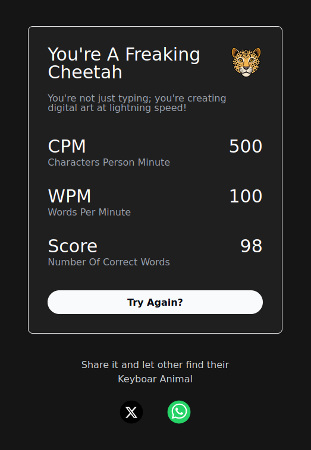
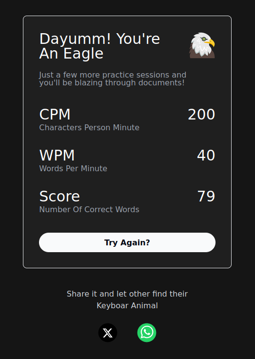
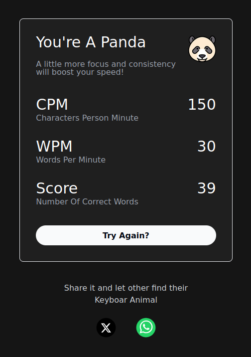
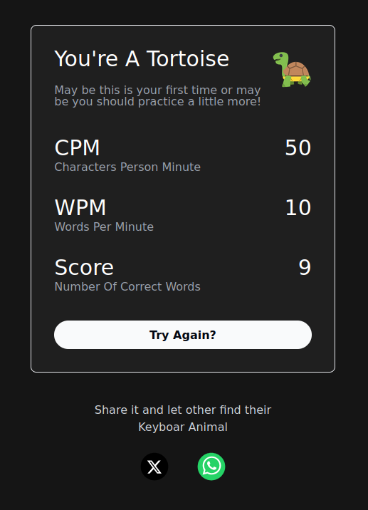

# Typing Speed Test - TypeFlash

[The Site Is Live Here. Try Out TypeFlash](https://typeflash.netlify.app/)

This is a simple yet a very insightful project for React + Typescript practice. It also includes dealing with API calls and fetching.

This project was built using React + TypeScript setup with vite using VScode. The process to set it up in your computer is given below.

#### Typeflash generate random words and tracks down your typing speed in WPM (Words Per Minute). The random words are generated from the following API

`https://random-word-api.herokuapp.com/word?number=100`

#### The "100" in the end of the URL denotes that everytime the API is called it generated 100 Random words.

TypeFlash is currently hosted in Github Page :

- [Visit this link to try out TypeFlash](https://typeflash.netlify.app/)

## What's Your Keyboard Animal?

 

